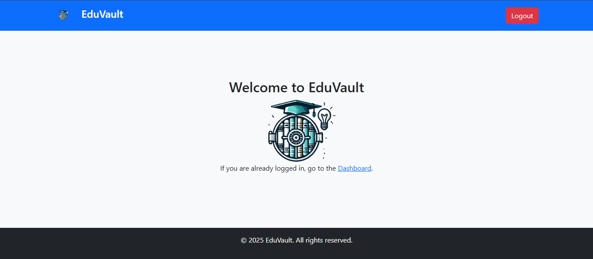
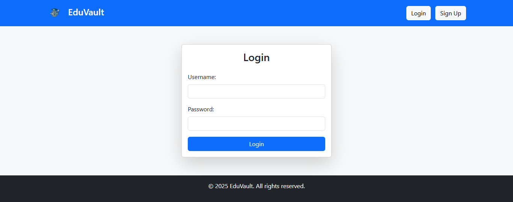
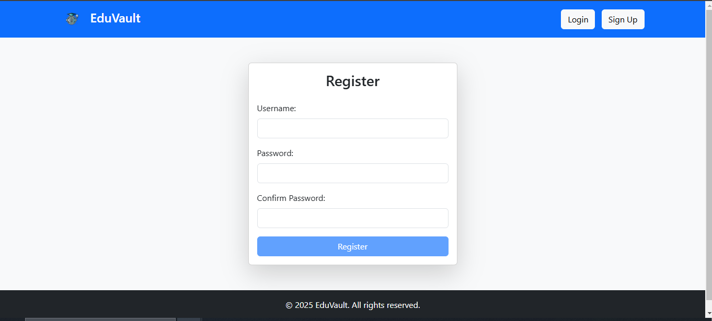
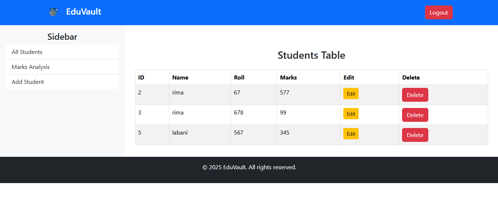
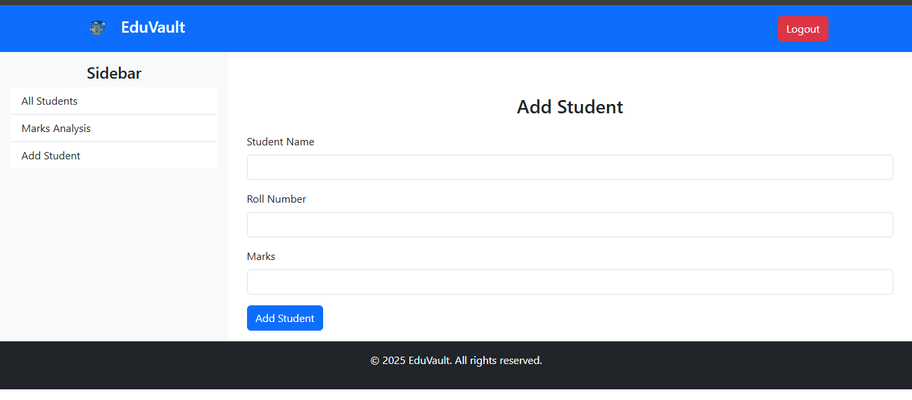
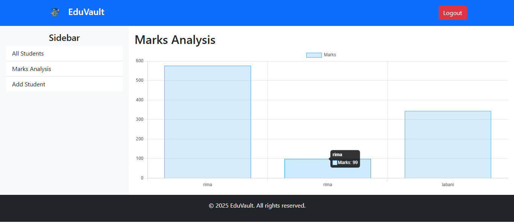
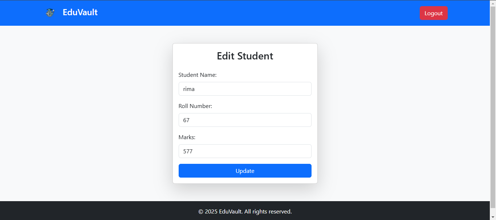

---

## **📸 Screenshots **  
Make sure you have the following installed:  
- Python (version 3.6 or higher)  
- pip (Python package manager)  

### Home Page 
  

### Login Page  
  

### Register Page  


### Dashboard Page  
  

### Student Data Entry  
  

### Graph
  

### Edit Student
  

---


## 🚀 **Getting Started**

Follow these steps to set up and run the EduVault project on your local machine.

---

### **Prerequisites**  
Make sure you have the following installed:  
- Python (version 3.6 or higher)  
- pip (Python package manager)  

---

### **Setup Instructions**  

1. **Clone the Repository**  
   ```bash
    git clone --branch python-cgi-crud-app https://github.com/yourusername/eduvault.git
   cd main.py
   ```  

2. **Install Dependencies**  
   Install the required Python libraries with:  
   ```bash
   pip install -r requirements.txt
   ```  

3. **Run the Server**  
   Start a local server using Python:  
   ```bash
   python -m http.server --cgi
   ```  

4. **Access the Application**  
   Open your browser and go to:  
   [http://localhost:8000/index.html](http://localhost:8000/index.html)  

---
